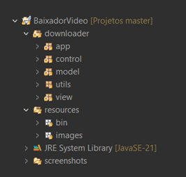

 
<h1> SaveTube </h1>

  
###  Download videos and audios from YouTube for free and without ads!

### ⚠️ Due to copyright reasons, i won't release the app. I'll just share some screenshots, the project structure and the technologies I used and how it works. Cool?
##

## 📂 Project Structure

##
## 🤖 Technologies used

> ### Jawa Swing | Yt-dlp | Ffmpeg | ProcessBuilder | BufferedReader | Threads | Callback | MVC Pattern
> ##

