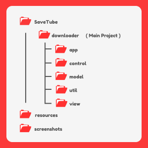
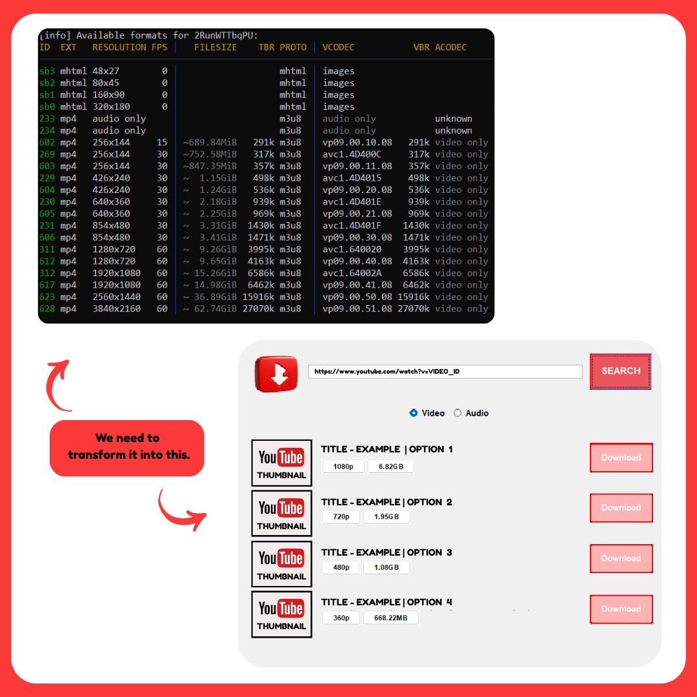
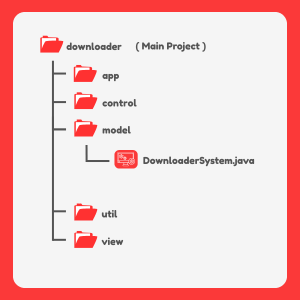

 
<<<<<<< Updated upstream
<h1> SaveTube </h1>
=======
<<<<<<< HEAD
<h1>  SaveTube  </h1>

=======
<h1> SaveTube </h1>
>>>>>>> 4f6db116365a02b427f75fab0dee75b430713b58
>>>>>>> Stashed changes
  

### Download videos and audios from YouTube for free and without ads!
### ⚠️ Due to copyright reasons, i won't release the app. I'll just share some screenshots, the project structure and the technologies I used and how it works. Cool?
##

<<<<<<< HEAD
=======
## 📂 Project Structure

##
## 🤖 Technologies used

> ### Jawa Swing | Yt-dlp | Ffmpeg | ProcessBuilder | BufferedReader | Threads | Callback | MVC Pattern

>>>>>>> 4f6db116365a02b427f75fab0dee75b430713b58
##
## 🤔 How to use?

#### 🔗 All you have to do is past the link in the rectangular box next to download image and click in SEARCH.
#### 🚫 Please don't use direct playlist links—they are not supported. However, if it's a video from a playlist, then it's supported.

#### 👀 Take a look

##

## 📂 You can choose the download location too.

##

## ⌛Once you have pasted the link and waited a little time. The app will show you the available video options.

##

## 🎵 You can download only the audio, if you want to.
<<<<<<< Updated upstream

=======
<<<<<<< HEAD

#
# ✍️ **CREATION**
#
## 📂 Project Structure

##
## 🤖 Technologies used

> ###  **Jawa Swing | Yt-dlp | Ffmpeg | ProcessBuilder | BufferedReader | Threads | Callback | MVC Pattern** 
# 
#
# 🤔 How did I make this application?👨‍💻

### First of all, I need to get what the Ytdlp returns.
### Then process it, and show only what is necessary to the user, in a cool interface.

## Like this👇

## The   **getInformationEachVideo()**  method of the DownloaderSystem class takes this function. It retrieves the **title, quality, size, code and thumbnail.**

## The  **DownloaderSystem**  class from the model package is the application's heart. It  **handles everything related to processing video and audio data**. Without it, there would be no application.

### All of the information that Ytdlp returns is stored in an ArrayList.
### The line contains the code, quality, size and other irrelevant information. So, I have to extract this for each video option.
### Each video option's quality is added to a HashMap as a key and the value for that key is an ArrayList containing the code and size of the corresponding video option.

> ### For example, suppose this is a line that Ytdlp returns:
> ###   -- 323 mp4 1920x1080 00 | 500mb 434k m3u8 | dsds.234434 3245k video_only 
> ### I need to extract '323', '1920x1080' and '500mb'

### 
### Then, put it into the HashMap, like this:

> * ### Create an ArrayList and add the code and size ('323' and '500mb').
> * ### Create a HashMap and add the quality as the key ('1080'), and the ArrayList you just created as the value.
#
#
## 🖥️ Then, the controller's methods will display each video option of this HashMap to the user in a cool interface.

=======

>>>>>>> 4f6db116365a02b427f75fab0dee75b430713b58
>>>>>>> Stashed changes
